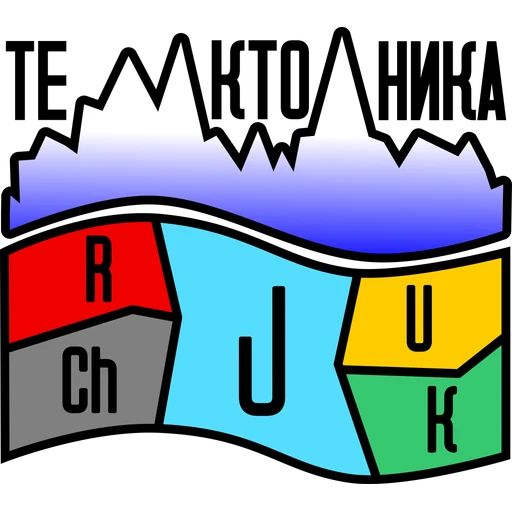

<div align="center">



# TEKTONIKA

### Геология. Геофизика. Данные. Без лишнего шума.

Корпоративная web-платформа ООО «ТЕКТОНИКА» — от публичного сайта и мультиязычного SEO до CMS, проектов, вакансий и инженерного контента.

[](https://www.tektonikadv.ru)
[](#stack)
[](#stack)
[](#backend--cms)

</div>

---

## 01 / О проекте

`tektonikamainn` — production-oriented корпоративный сайт геолого-геофизической компании из Хабаровска.

Платформа объединяет:

- корпоративный сайт с отдельными разделами услуг, проектов, исследований, медиа и вакансий;
- интерактивную географию проектов;
- CMS на FastAPI + MySQL;
- административную панель;
- RU / EN / ZH локализацию;
- отдельные индексируемые URL для языковых версий;
- техническое SEO, Schema.org, Open Graph, sitemap и robots.txt;
- оптимизированную delivery-схему изображений;
- EmailJS-форму обратной связи;
- fallback-контент при недоступности API.

> **Production:** https://www.tektonikadv.ru

---

## 02 / Stack

| Layer | Technology |
|---|---|
| Frontend | React 19 |
| Language | TypeScript 5.8 |
| Build | Vite 6 |
| UI | Tailwind CSS 3 |
| Motion | Framer Motion |
| Routing | React Router |
| Maps | Leaflet |
| Icons | Lucide React |
| HTTP | Axios |
| Contact form | EmailJS |
| Backend | FastAPI |
| Database | MySQL |
| Validation | Pydantic |
| SEO build | Custom Node postbuild pipeline |
| Image pipeline | Sharp / WebP |
| CI | GitHub Actions |

---

## 03 / Product map

```text
/
├── services              услуги и производственные направления
├── projects              проекты + география
├── about                 компания и реквизиты
├── media                 фото и материалы
├── research              научная деятельность
├── careers               вакансии
├── contacts              контакты и форма связи
├── privacy               политика конфиденциальности
├── agreement             пользовательское соглашение
├── en/*                   английская версия
├── zh/*                   китайская версия
└── tektonika-admin        CMS / administration
```

Основные страницы загружаются через route-level splitting. Изменяемый контент может поступать из CMS; при недоступности API публичная часть использует локальный fallback.

---

## 04 / Быстрый старт

### Requirements

- Node.js 20+
- npm
- Python 3.10+
- MySQL — только если нужен CMS backend

### Frontend

```bash
git clone https://github.com/richmanstudio/tektonikamainn.git
cd tektonikamainn
npm ci
npm run dev
```

Vite запустит локальный frontend.

### Production build

```bash
npm run build
```

После `vite build` автоматически выполняется SEO postbuild, который генерирует статические entrypoints для индексируемых маршрутов, `sitemap.xml`, `robots.txt` и SEO-safe `404.html`.

---

## 05 / Environment

Frontend использует Vite environment variables.

```env
VITE_API_URL=http://127.0.0.1:8000/api

VITE_EMAILJS_SERVICE_ID=
VITE_EMAILJS_TEMPLATE_ID=
VITE_EMAILJS_PUBLIC_KEY=
```

Не храните production credentials и secrets в репозитории.

---

## 06 / Backend + CMS

Backend находится в [`backend/`](backend/).

### Setup

```bash
cd backend
python -m venv .venv
```

macOS / Linux:

```bash
source .venv/bin/activate
python -m pip install -r requirements.txt
cp .env.example .env
```

Windows PowerShell:

```powershell
.\.venv\Scripts\Activate.ps1
python -m pip install -r requirements.txt
Copy-Item .env.example .env
```

Заполните `.env` реальными MySQL-данными, затем:

```bash
python -m app.init_db
python -m app.seed
uvicorn app.main:app --reload --host 127.0.0.1 --port 8000
```

Основные endpoints:

```text
GET    /api/health
POST   /api/auth/login
GET    /api/public/site?lang=ru
GET    /api/public/{collection}?lang=ru
GET    /api/cms/entries
POST   /api/cms/entries
PUT    /api/cms/entries/{id}
DELETE /api/cms/entries/{id}
```

CMS endpoints требуют Bearer token.

Подробнее: [`backend/README.md`](backend/README.md)

---

## 07 / SEO architecture

SEO здесь не ограничивается одним `index.html`.

Реализовано:

- уникальные `title` и `meta description` по основным маршрутам;
- canonical URL;
- `robots` / `googlebot` directives;
- Open Graph;
- Twitter Cards;
- Schema.org JSON-LD;
- `Organization`;
- `WebSite`;
- `WebPage` / `AboutPage` / `ContactPage` / `CollectionPage`;
- `Service`;
- `BreadcrumbList`;
- multilingual `hreflang`;
- `x-default`;
- отдельные RU / EN / ZH URLs;
- sitemap с локализованными страницами;
- `noindex` для admin и неизвестных маршрутов.

### Language URLs

```text
RU  /services
EN  /en/services
ZH  /zh/services
```

Русская версия — основная. Английская и китайская версии имеют собственные URL и cross-language alternates.

---

## 08 / Performance

Raster assets проходят отдельную оптимизацию.

Текущий результат:

```text
33 images converted
59.7 MB  →  8.0 MB
−51.6 MB
−86.5%
```

Используется WebP с ограничением избыточного исходного разрешения.

Полный отчёт: [`IMAGE_OPTIMIZATION_REPORT.md`](IMAGE_OPTIMIZATION_REPORT.md)

---

## 09 / Project structure

```text
tektonikamainn/
├── backend/                FastAPI CMS + MySQL
├── public/                 public SEO/social assets
├── scripts/                build-time SEO & image tools
├── src/
│   ├── assets/             optimized media
│   ├── components/         reusable UI
│   ├── content/            fallback business data
│   ├── layouts/            shared layouts
│   ├── pages/              route pages
│   ├── routes/             routing
│   ├── cms.tsx             CMS data layer
│   ├── i18n.tsx            RU / EN / ZH dictionaries
│   └── main.tsx            application bootstrap
├── .github/workflows/      CI / deploy / optimization
├── index.html
├── package.json
└── README.md
```

---

## 10 / Scripts

```bash
npm run dev        # development server
npm run build      # production build + SEO postbuild
npm run predeploy  # build before deployment
npm run deploy     # deploy dist through gh-pages
```

Image optimization pipeline:

```bash
node scripts/optimize-images.mjs
```

SEO generation:

```bash
node scripts/generate-seo-pages.mjs
```

---

## 11 / Engineering principles

**01. Content survives API failure.**  
Публичный сайт имеет fallback-контент и не превращается в пустую оболочку при недоступности CMS.

**02. Search is part of the product.**  
SEO генерируется как часть production build, а не добавляется вручную после релиза.

**03. Media must earn its bytes.**  
Тяжёлые изображения не должны попадать в production без оптимизации.

**04. One system, three languages.**  
RU / EN / ZH работают в одной UI-системе, но имеют отдельные индексируемые URL.

**05. Corporate ≠ boring.**  
Интерфейс остаётся строгим и инженерным, но не выглядит как типовой шаблон B2B-сайта.

---

## 12 / Deployment

Frontend собирается в `dist/`.

```bash
npm run build
```

Для backend предусмотрен отдельный deployment flow. Инструкция для REG.RU / ISPmanager находится здесь:

[`backend/REG_RU_ISPMANAGER.md`](backend/REG_RU_ISPMANAGER.md)

Перед production deployment обязательно используйте реальные environment variables и собственные secrets.

---

## Status


---

<div align="center">

### TEKTONIKA × DUONIQ

**Engineering-first web development.**  
Two founders. One clear result.

`2026`

</div>
